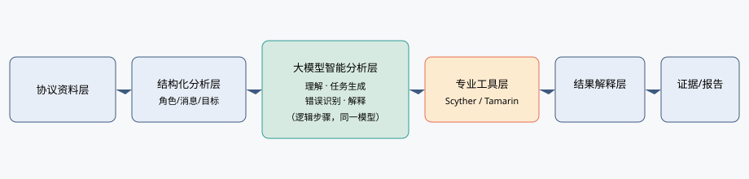
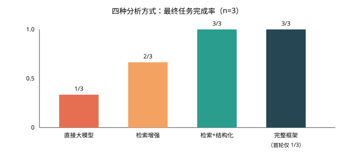

# 基于大模型的密码协议智能分析方法及工程应用研究

## 摘要

密码协议分析依赖分散的规范与论文、复杂的版本关系、以及 Scyther、Tamarin 等专业工具，结果解释又高度依赖专家经验。大模型能够阅读协议文本并起草分析模型，但不能单独充当安全证明。本文给出一套以大模型为分析编排主体、以专业工具为事实约束的智能分析方法：先把协议来源、版本、角色、消息、密钥、安全目标和攻击者假设组织成可检查的结构，再生成可执行分析任务，由本地专业工具返回属性结果，最后沿“规范→任务→工具原始结果→解释→结论边界”生成可追溯报告。

在隔离条件下，以 Grok 4.6 为唯一被试，对 Needham–Schroeder 公钥协议三消息核心、Needham–Schroeder–Lowe 以及 ISO/IEC 9798-2 机制 3 比较四种分析方式。直接大模型的最终任务完成率为 1/3，检索增强为 2/3，检索加结构化分析与完整工具回喂框架均为 3/3；完整框架的首轮完成率仅为 1/3，两例语法失败经工具原始报错回喂后均在第 2 轮修复。Needham–Schroeder 公钥核心上，四种方式均复现公开模型中“发起方属性成立、响应方机密性与认证被证伪”的 Lowe 攻击模式。对 Minimal IKEv2（RFC 7815 口径）预注册的 5 条 Tamarin lemma——`exists_session`、`aliveness`、`weak_agreement`、`agreement`、`key_secrecy`——全部 verified。方法降低了资料组织、模型准备和结论边界声明的门槛，但不能替代专家对语义与安全判断的终审；公开模型结果不等于现行标准全文的实现安全。

**关键词：** 大模型；密码协议分析；专业工具协同；证据链；工程实践

## 一、引言

密码协议是认证、密钥协商和安全通信的基础机制。TLS、IKEv2、实体鉴别国际标准以及经典学术协议，构成检测、安全设计和协议研究中的常见对象。一次完整分析通常要完成：定位正式规范与公开模型、对齐版本、抽出角色与消息、声明安全目标、准备可执行模型、调用专业工具、阅读攻击轨迹或未完成证明，并写成可复核结论。

该工作难以自动化的原因并不只是“形式化工具难用”。资料分散在 RFC、国际标准和论文中；现行文本与历史公开模型经常不是同一版本；自然语言描述到分析任务会丢失身份绑定、消息方向或新鲜性假设；Scyther、Tamarin 的原始输出需要再解释为“哪一条属性、在何种抽象下、对哪一文本成立”。直接向通用大模型询问“某协议是否安全”，既可能生成可运行但语义错误的模型，也可能把超时或单角色反例写成协议整体证明。

大模型的机会在于：它能阅读长文本、组织协议知识、起草分析任务并解释工具日志。风险同样清楚：它没有稳定的来源意识和版本意识，也不能把生成文本当作安全证明。本文的方法因此把职责切开——大模型负责知识组织与分析编排，专业工具负责给出可执行、可复核的事实约束。

本文贡献有三点。（1）协议知识组织与任务结构化：把来源/版本、角色、消息、密钥、密码操作、安全目标、攻击者假设和公开模型边界写成统一字段，降低直接处理长篇规范时的语义漂移。（2）大模型与专业分析工具的协同闭环：用工具的语法错误、属性表和超时原文约束模型修正，而不是用模型自信程度决定对错。（3）面向实际工作的结果解释与证据化评价：建立规范→任务→工具→原始结果→解释→结论边界的证据链，并报告任务完成率、与公开参考的一致性、已知攻击复现、自动修复和人工介入。

## 二、密码协议智能分析的关键问题

### （一）资料与版本关系复杂

TLS 1.3 现行 Standards Track 文本为 RFC 9846[1]，历史定稿为 RFC 8446[2]；公开 Tamarin 模型 TLS13Tamarin 对准 draft-21[20][23]。IKEv2 现行 Internet Standard 为 RFC 7296[5]，而可公开复现的符号模型包括 2011 年 Scyther IKE 套件[18]以及 Minimal IKEv2（RFC 7815）的 Tamarin 模型[6][24]。ISO/IEC 9798-2 现行为 2019 年认证加密版[15]，Basin 等分析与发行包 SPDL 对应约 2008/2010 年对称加密文本[17][25]。把历史模型结果写成现行标准证明，是分析报告中最常见的越界方式之一。

### （二）协议语义难以直接转化为分析任务

角色、nonce、密钥、身份绑定、消息方向和安全目标容易在“能写下一份模型”的过程中丢失。Needham–Schroeder 公钥协议的三消息核心与带认证服务器的原文不是同一任务[9]；Lowe 修复只改响应消息中的身份绑定[10][11]。可执行不等于语义正确：漏写响应者身份后，模型仍能被工具接受，但已经不是 NSL。

### （三）专业工具结果需要进一步解释

Scyther 给出 verified / falsified / bounded 与攻击轨迹[21]；Tamarin 给出 lemma 的 exists-trace / all-traces 摘要[22]。这些输出必须翻译为：攻击影响哪一角色的哪一属性、成立条件是什么、结论覆盖哪一文本。超时和 derivation-check 警告尤其不能写成“协议不安全”或“已验证”。

### （四）AI 结论必须有证据约束

没有“规范→任务→工具原始结果→解释→结论边界”的链路，大模型的流畅叙述无法被第三方复核。本文把专业工具当作证据来源，而不是把工具教程写成文章主体。

## 三、基于大模型的密码协议智能分析方法

### （一）总体架构

方法分为六层：协议资料层、结构化分析层、大模型智能分析层、专业工具层、结果解释层、证据/报告层。多智能体只作为智能分析层内部的逻辑步骤（资料整理、结构化、生成、根据反馈修改、解释），实验中由同一大模型执行，不声称已部署独立 Agent 产品。总体架构见图1。

**图1 密码协议智能分析总体架构**

### （二）协议知识获取与版本对齐

来源优先级为正式 RFC/国际标准、工具官方模型库、作者仓库和同行评审论文。每条分析必须写明：当前标准、公开模型对应版本、已知限制、本文用途。表1给出本文涉及协议的版本关系。

**表1 协议资料与版本关系**

| 协议 | 现行文本 | 公开模型 | 模型对应版本 | 已知限制 | 本文用途 |
|---|---|---|---|---|---|
| NS-PK 三消息核心 | Needham & Schroeder 1978[9] | Scyther 公开 ns3 | 1978 三消息核心 | 不含密钥服务器 | 已知攻击复现与方式对照 |
| NSL | Lowe 1996 修复[11] | Scyther 公开 nsl3 | 第 2 条含响应者身份 | 学术核心，非 PKI | 修复语义是否被建模 |
| ISO/IEC 9798-2 机制 3 | 2019 认证加密[15] | Scyther 2010 编码[17][25] | 2008/2010 对称加密 | 2010≠2019 | 版本边界与鉴别建模 |
| IKEv2 | RFC 7296[5] | tamarin-ikev2[24] | Minimal IKEv2 / RFC 7815[6] | 非 STD 79 全文 | 主案例属性表 |
| TLS 1.3 | RFC 9846[1] | TLS13Tamarin rev21[23] | draft-21[20] | draft≠RFC 9846 | 补充案例；全量 lemma 不作为主结果 |

### （三）协议语义结构化与任务生成

在生成可执行模型之前，强制输出：角色、消息方向、长期密钥、临时值、密码操作、安全目标、攻击者假设、版本/模型边界。该步骤的目的不是发明新的中间语言，而是把“直接把 RFC 喂给模型”改成可检查的任务。流程见图2：规范/论文→结构化协议分析→安全目标→专业分析任务。

### （四）专业工具协同与反馈修正

大模型准备任务后，只通过本地专业工具执行。Scyther 使用官方 Windows 可执行文件的 XML 输出；Tamarin 使用 WSL 中的 tamarin-prover 1.12.0。成功、失败、超时和 wellformedness 警告全部保留。完整框架最多回喂 3 轮工具原始输出（stderr、claim 表、lemma 摘要），禁止打开目标公开模型源码抄写。闭环见图3。

实践中，工具封装本身也会成为人工介入点：Windows 下 Scyther 输出需按二进制/latin-1 读取；Tamarin 若启用 quit-on-warning，会把 derivation-check 超时误判为理论失败。后一情况记入实验设置，不把警告当成安全结论。

### （五）结果智能解释与证据生成

每条对外结论填写表2字段。禁止把 bounded、timeout、单角色 falsified 自动升级为协议整体否定。

**表2 AI 分析结论与证据字段**

| 字段 | 含义 |
|---|---|
| 安全目标 | 角色 × 属性或 lemma 名 |
| 工具结果 | verified / falsified / bounded / timeout |
| AI 解释 | 攻击或成立条件的限定叙述 |
| 证据 | 原始 XML / lemma 摘要行 / 日志 |
| 结论边界 | 对应文本、抽象、是否可外推到实现 |

## 四、实验结果与分析

为验证方法的可行性和有效性，本文设置直接大模型、协议资料检索增强、检索增强加结构化分析、以及“结构化分析 + 专业工具回喂”的完整框架四种方式，选取 Needham–Schroeder 公钥核心、NSL、ISO/IEC 9798-2 机制 3 做方式对照，并以 Minimal IKEv2 和 TLS 1.3 draft-21 公开模型作为协议级案例。被试固定为 Grok 4.6；每个协议×方式使用独立提示，输入包中不含目标公开 `.spdl`/`.spthy`。实验为单操作者、提示与目录隔离，不是双盲实验室。下列数字来自新跑任务，不把旧编排台账的 28/28 完成率写入摘要。

### （一）实验设置

**表3 实验协议集**

| 协议 | 工具 | 金标/参考 | 进入图4 | 备注 |
|---|---|---|---|---|
| NS-PK 三消息核心 | Scyther 无界 | 公开 ns3：I 侧 verified，R 侧 Secret/Niagree/Nisynch falsified | 是 | 与 Lowe 攻击同类[10] |
| NSL | Scyther 无界 | 公开 nsl3：8 条 verified | 是 | 修复语义 |
| ISO/IEC 9798-2-3 | Scyther `--max-runs=5` | 2010 公开模型：Commit falsified，Alive/Weakagree bounded | 是 | 不得写成 2019 证明 |
| Minimal IKEv2 | Tamarin | 预注册 5 条 lemma | 否 | 主案例 |
| TLS 1.3 draft-21 | Tamarin 1.12.0 | 预注册 3 条 lemma | 否 | 展开理论崩溃，无属性摘要 |

四种方式的自变量只有输入约束：直接大模型只给协议范围短描述（无完整消息列表）；检索增强增加规范/论文转述；结构化分析强制先填表2之前的八字段；完整框架在此基础上回喂工具原文。生成物均实际调用本地 Scyther。计分：语法失败为未完成；结果一致只比较与金标重叠的角色×属性类型；NS-PK 若双方 Secret 均 falsified，不计为复现 Lowe。人工介入只计环境与超时策略，主试不改待评模型语义。

### （二）不同 AI 分析方式对比

直接大模型在 3 个协议上最终完成 1 个（仅 NS-PK）。NS-PK 是教科书级协议，短描述虽无消息列表，模型仍写出 `{Ni,I}pk(R)`、`{Ni,Nr}pk(I)`、`{Nr}pk(R)` 的 1978 核心，并与公开 ns3 一致。这说明：对已进入预训练语料的协议，“无消息列表”并不能保证 M0 失败；完成率低主要来自 NSL、ISO 的 **Scyther 标识符语法**（claim 名中的 `_`），而不是消息漏写。

检索增强把 NSL 补到可解析且 8 条 claim 全部 verified，与公开 nsl3 一致；ISO 仍因 `_` 未完成。检索加结构化分析使三个协议均能解析。完整框架首轮同样在 NSL 与 ISO 上因 `_`（NSL 另误把 `pk` 写成 `hashfunction`）失败，回喂 stderr `syntax error at symbol '_'` 后，第 2 轮全部可解析。自动修复 2/2，平均修复轮次 0.67，人工介入 0 次。

**图4 不同 AI 分析方式最终任务完成率**

与公开参考的一致性不能只看完成率。NS-PK、NSL 在已完成任务上与金标类型完全一致（各 6/6）。ISO 已完成模型声明的是 Alive/Weakagree/Niagree/Nisynch，金标是 Commit/Alive/Weakagree；重叠的 Alive/Weakagree 在 `--max-runs=5` 下为 verified，金标为 bounded，记为不一致，并在表4注明 claim 集合不同。

### （三）协议级分析结果

**表4 协议级结果（方式对照 + 工具基线）**

| 协议 | 工具 | 安全目标（摘要） | 参考结果 | AI 结果（完整框架最终） | 是否一致 | 修复轮次 | 人工介入 | 说明 |
|---|---|---|---|---|---|---|---|---|
| NS-PK | Scyther | I/R × Secret, Niagree, Nisynch | I 成立，R 证伪 | 同参考 | 是 | 0 | 否 | 四种方式均同 |
| NSL | Scyther | 同上 | 全部 verified | 全部 verified | 是 | 1 | 否 | 直接大模型未完成 |
| 9798-2-3 | Scyther | 鉴别类 | 2010：Commit 证伪等 | Alive/Weakagree 成立，Niagree/Nisynch 证伪 | 重叠项不一致 | 1 | 否 | 2010≠2019；claim 集合不同 |
| Minimal IKEv2 | Tamarin | 见表5 | 公开模型目标 | 5/5 verified | 按预注册表 | — | 工具警告策略 1 次 | 非 RFC 7296 全文 |
| TLS 1.3 draft-21 | Tamarin | handshake_secret 等 3 条 | 公开 rev21 理论 | 无摘要（求解器崩溃） | 否 | — | 否 | 不能写成已验证或超时即不安全 |

公开 ns3 / nsl3 的 XML 只作为专业工具基线，不计入四种方式的“大模型调用次数”。

### （四）典型案例：Minimal IKEv2

主案例选用 Minimal IKEv2，而不是超时的 Scyther `ikev2-sig` 片段。规范链为：IPsec 架构 RFC 4301[4] → IKEv2 RFC 7296[5] → 发起方子集 RFC 7815[6]；公开 Tamarin 模型声明其对象为 Minimal IKEv2，并可选 IKE_INTERMEDIATE 扩展[24]。SIGMA 是签名模式的密码学背景[14]，不在本案例中当作 RFC 7296 验证。

分析步骤：（1）版本对齐：结论只覆盖 Minimal IKEv2 符号模型，不写 STD 79 的 CREATE_CHILD_SA、NAT-T、EAP 等分支；（2）预注册 lemma，禁止跑完后只报告变绿项；（3）首次用带 `--quit-on-warning` 的封装时，derivation-check 超时导致 5 条 lemma 均无摘要，该次记为封装失败而非协议结论；（4）关闭 quit-on-warning 并将 derivcheck-timeout 置 0 后，得到表5。

**表5 Minimal IKEv2 证据链（Tamarin 1.12.0）**

| 安全目标 | 工具结果 | 解释 | 证据 | 结论边界 |
|---|---|---|---|---|
| exists_session | verified（32 steps） | 存在一次完整会话迹 | lemma 摘要行 | 模型可执行，不是安全证明 |
| aliveness | verified（15 steps） | 发起方视角存活性 | 同上 | 该文件为发起方取向模型 |
| weak_agreement | verified（36 steps） | 弱一致 | 同上 | 非 RFC 7296 全文 |
| agreement | verified（36 steps） | 一致 | 同上 | 同上 |
| key_secrecy | verified（58 steps） | 会话密钥机密性 | 同上 | 符号抽象，非实现 |

TLS 1.3 作为补充而非主案例。公开模型对准 draft-21[20][23]，现行文本为 RFC 9846[1]。预注册 `handshake_secret`、`secret_session_keys`、`injective_mutual_entity_authentication`，在 `src/rev21/proofs/injective_auth.spthy` 上按条调用 Tamarin 1.12.0。理论可以装载，但在 `F_State_C1` 上以 `shapeTerm: the term (t.9) does not have enough pairs` 中止，三条 lemma 均无 verified/falsified 摘要。这是工具版本与 2017 年展开理论不兼容，不是“TLS 1.3 不安全”，也不能改写成 RFC 9846 结论。主案例因此保持 Minimal IKEv2。

### （五）AI 工程能力评价

**正确性。** NS-PK 已知攻击复现 4/4 方式 × 1 协议；NSL 在可完成方式上与公开修复模型一致。ISO 暴露“可运行模型 ≠ 与历史公开模型同一 claim 集合”。解释正确性的硬证据是：IKEv2 首次封装失败被解释为警告策略而非协议不安全。

**自动化。** 完整框架最终成功率 3/3，首轮 1/3；自动修复 2/2，修复原因是工具语法，不是安全语义。直接大模型不能稳定通过工具词法。检索和结构化主要提升“能否交出可解析模型”。

**效率。** Scyther 单模型均在 1 秒量级。IKEv2 五条 lemma 在去掉误杀警告后于约 1 分钟内全部给出摘要。完整框架因多轮调用工具，墙钟高于一过性生成，但换来最终完成。

能力对比的工程含义是：大模型真正节省的是资料编排、模型起草和把 stderr 翻成修改动作；它并不自动提高与某份历史公开模型在 claim 命名上的一致，也不消除版本错位。

### （六）失败案例与局限

1. **工具词法。** NSL 直接大模型、ISO 直接大模型与检索增强因标识符含 `_` 无法解析。这是真实工程失败，不是“故意 Out 新鲜值”。
2. **预训练记忆与消融污染。** NS-PK 直接大模型在无消息列表时仍写出标准三步，方式对照对著名协议偏乐观。
3. **安全目标集合漂移。** ISO 完整框架模型未声明 Commit，Alive/Weakagree 与 2010 公开模型的 bounded 不一致；不能写成“复现 Basin 反例”[17]。
4. **工具封装误杀。** Tamarin quit-on-warning 把 derivation-check 超时当成失败。属必须人工理解的工具行为。
5. **工具与模型年代不兼容。** TLS13Tamarin rev21 展开理论在 Tamarin 1.12.0 上崩溃，预注册 lemma 得不到属性表。按合同进入失败/局限，不改选未注册 lemma 充数。
6. **范围。** 符号模型不覆盖实现缺陷；IKEv2 结果不是 RFC 7296 全文；TLS 公开模型不是 RFC 9846；ISO 2010 编码不是 2019 标准。

## 五、讨论与总结

用新跑的隔离实验而不是编排台账来总结：完整框架把三个对照协议的最终完成率从直接大模型的 1/3 提升到 3/3，但首轮仍只有 1/3，增益首先来自“读懂 Scyther 报错并改标识符”。在著名协议 NS-PK 上，四种方式都能复现 Lowe 攻击模式；在 NSL 上，缺少检索或结构化时，失败首先表现为工具语法。Minimal IKEv2 上，预注册 5 条 lemma 全部 verified，前提是分析人员写清 RFC 7815 口径并正确处理 Tamarin 警告。

方法真正接手的专家型步骤是：版本表、结构化字段、把规范变成可跑任务、把工具原文变成修改、把属性表写成带边界的结论。它不能接手的是：选择哪一份公开模型代表“当前标准”、判断 bounded 与 falsified 对检测结论的含义、以及任何实现层安全。

工程上，流程可服务于密码协议检测辅助、设计审查草稿、协议研究复现和报告底稿，并把专家知识沉淀为可重复的输入包与计分规则。复杂协议仍需专家审查；模型安全不等于实现安全。

## 参考文献

[1] RESCORLA E. The Transport Layer Security (TLS) Protocol Version 1.3: RFC 9846[S/OL]. RFC Editor, 2026[2026-09-03]. https://www.rfc-editor.org/info/rfc9846. DOI: 10.17487/RFC9846.

[2] RESCORLA E. The Transport Layer Security (TLS) Protocol Version 1.3: RFC 8446[S/OL]. RFC Editor, 2018[2026-09-03]. https://www.rfc-editor.org/info/rfc8446. DOI: 10.17487/RFC8446.

[4] KENT S, SEO K. Security Architecture for the Internet Protocol: RFC 4301[S/OL]. RFC Editor, 2005[2026-09-03]. https://www.rfc-editor.org/info/rfc4301. DOI: 10.17487/RFC4301.

[5] KAUFMAN C, HOFFMAN P, NIR Y, et al. Internet Key Exchange Protocol Version 2 (IKEv2): RFC 7296[S/OL]. RFC Editor, 2014[2026-09-03]. https://www.rfc-editor.org/info/rfc7296. DOI: 10.17487/RFC7296.

[6] KIVINEN T. Minimal Internet Key Exchange Version 2 (IKEv2) Initiator Implementation: RFC 7815[S/OL]. RFC Editor, 2016[2026-09-03]. https://www.rfc-editor.org/info/rfc7815. DOI: 10.17487/RFC7815.

[9] NEEDHAM R M, SCHROEDER M D. Using encryption for authentication in large networks of computers[J]. Communications of the ACM, 1978, 21(12): 993-999. DOI: 10.1145/359657.359659.

[10] LOWE G. An attack on the Needham-Schroeder public-key authentication protocol[J]. Information Processing Letters, 1995, 56(3): 131-133. DOI: 10.1016/0020-0190(95)00144-2.

[11] LOWE G. Breaking and fixing the Needham-Schroeder public-key protocol using FDR[C]//TACAS 1996. LNCS 1055. Berlin: Springer, 1996. DOI: 10.1007/3-540-61042-1_43.

[14] KRAWCZYK H. SIGMA: the SIGn-and-MAc approach to authenticated Diffie-Hellman and its use in the IKE protocols[C]//CRYPTO 2003. LNCS 2729. Berlin: Springer, 2003: 400-425. DOI: 10.1007/978-3-540-45146-4_24.

[15] ISO/IEC. IT Security techniques — Entity authentication — Part 2: Mechanisms using authenticated encryption: ISO/IEC 9798-2:2019[S]. Geneva: ISO, 2019.

[17] BASIN D, CREMERS C, MEIER S. Provably repairing the ISO/IEC 9798 standard for entity authentication[C]//POST 2012. LNCS 7215. Berlin: Springer, 2012: 129-148. DOI: 10.1007/978-3-642-28641-4_8.

[18] CREMERS C. Key exchange in IPsec revisited: formal analysis of IKEv1 and IKEv2[C]//ESORICS 2011. LNCS 6879. Berlin: Springer, 2011: 315-334. DOI: 10.1007/978-3-642-23822-2_18.

[20] CREMERS C, HORVAT M, HOYLAND J, et al. A comprehensive symbolic analysis of TLS 1.3[C]//CCS 2017. New York: ACM, 2017: 1773-1788. DOI: 10.1145/3133956.3134063.

[21] CREMERS C. The Scyther tool: verification, falsification, and analysis of security protocols[C]//CAV 2008. LNCS 5123. Berlin: Springer, 2008: 414-418.

[22] MEIER S, SCHMIDT B, CREMERS C, et al. The TAMARIN prover for the symbolic analysis of security protocols[C]//CAV 2013. LNCS 8044. Berlin: Springer, 2013: 696-701.

[23] TLS13TAMARIN PROJECT. TLS13Tamarin: a Tamarin model of TLS 1.3[CP/OL]. GitHub, 2017[2026-09-03]. https://github.com/tls13tamarin/TLS13Tamarin.

[24] MNM-TEAM. tamarin-ikev2: Tamarin model for IKEv2[CP/OL]. GitHub, 2021[2026-09-03]. https://github.com/mnm-team/tamarin-ikev2.

[25] CREMERS C. The Scyther tool repository[CP/OL]. GitHub[2026-09-03]. https://github.com/cascremers/scyther.
